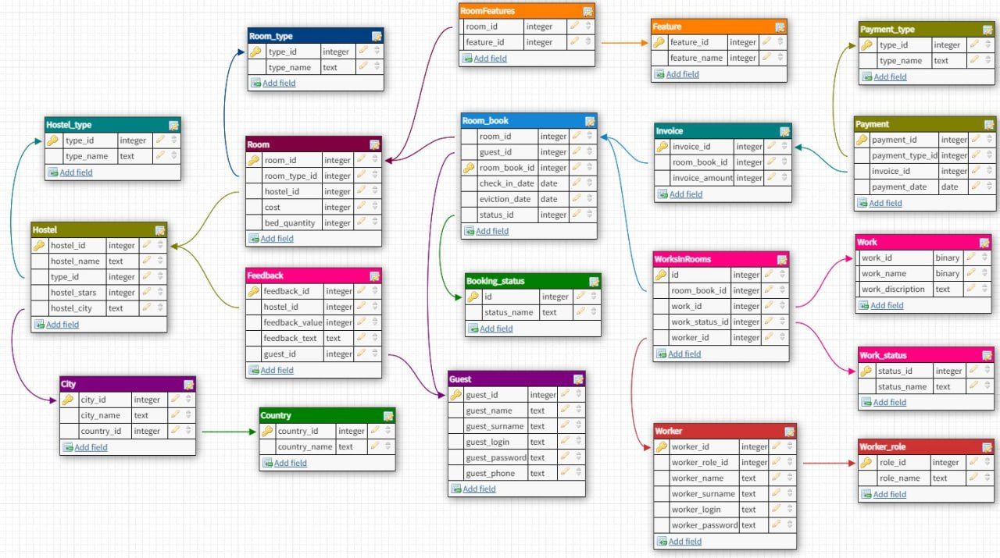
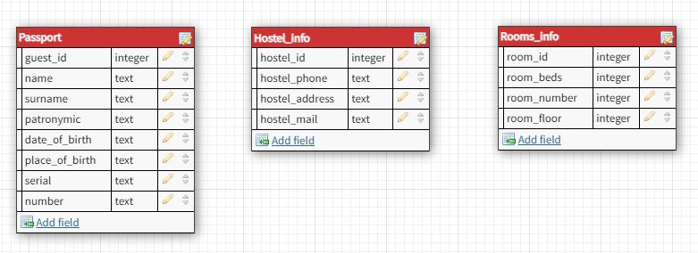

## Разработка прототипа приложения для бронирования номеров сети отелей

### Структура баз данных
ER-модель реляционной базы данных:


Таблицы документо-ориентированной базы данных:


### Руководство для запуска

```py 
pip install -r requirements.txt
streamlit run main.py
```
